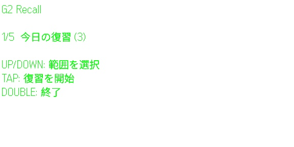
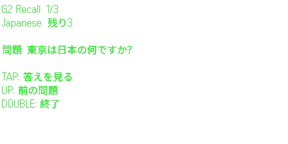
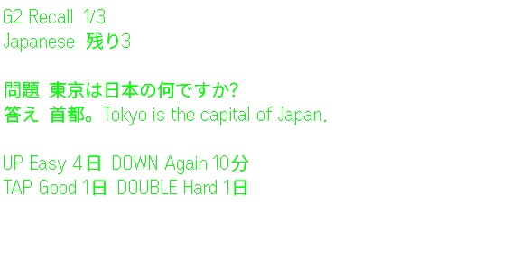
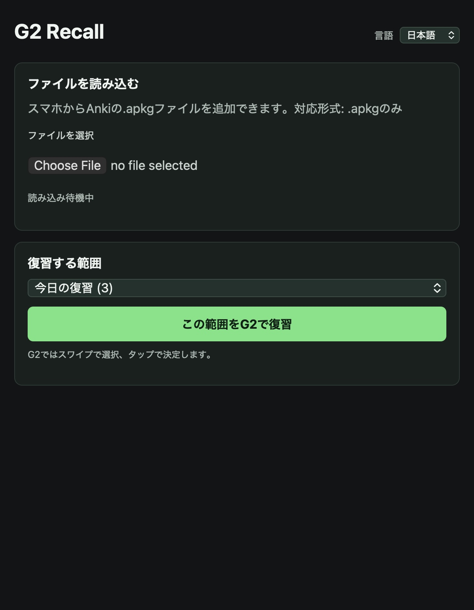

# G2 Recall

G2 Recall is a local spaced-repetition flashcard app built for **Even G2**. It puts the review loop on the glasses: choose a range, reveal the answer, grade the card, and move on without reaching for a phone.

The Even Hub app is the primary product in [`evenhub/`](evenhub/). The repository also contains an optional browser prototype for inspecting, editing, and converting card data.

> G2 Recall is an independent open-source project. It is not affiliated with Anki, AnkiWeb, or Ankitects.

## Screenshots

### Even G2 display

The G2 images below were captured from the official Even Hub simulator and use the same 576x288 display layout as the packaged app.

| Choose a range | Question | Answer and grades |
| --- | --- | --- |
|  |  |  |

### Phone controller

The phone-side Even Hub page is used to import `.apkg` files and choose the file or deck to review.



## Features

### Even G2 app

- Choose `Today's review`, all cards, an imported file, or an individual deck on G2.
- Import Anki `.apkg` files from the phone-side controller. Other file types are rejected.
- Keep multiple imported sources and give them display names on the phone.
- Japanese and English language selection for the phone controller and G2 UI.
- Persistent local review state with due time, interval, ease, repetitions, and lapses.
- Again cards return later in the same session and are scheduled for a 10-minute retry.
- Compact gesture-based review designed for short sessions.

### Optional browser prototype

The root `index.html` is a separate local browser prototype. It is useful for preparing and inspecting card collections, but it is not required by the G2 app and does not share its local data.

It includes deck browsing, Basic/reversed/Cloze notes, tags, flags, suspension, burying, daily limits, statistics, JSON backup/restore, TSV import/export, and common `.apkg` import/export.

## G2 controls

| Screen | Gesture | Action |
| --- | --- | --- |
| Range menu | Swipe up/down | Choose a range |
| Range menu | Tap | Start reviewing |
| Any G2 screen | Double tap | Exit the app |
| Question | Tap | Show the answer |
| Question | Swipe up | Return to the previous card |
| Answer | Tap | Good |
| Answer | Swipe up | Easy |
| Answer | Swipe down | Again |
| Answer | Double tap | Hard |

The answer screen shows the next interval for each grade so the gesture choice is visible before you commit it.

## Install a private build

The simplest way to try the packaged app on your own glasses is an Even Hub private build:

1. Open the project in the Even Hub developer portal.
2. Upload `evenhub/dist/g2-recall.ehpk` as a private build.
3. In the Even Realities phone app, open `Even Hub > Me > Apps > Private builds`.
4. Install or update **G2 Recall**, then launch it from the app list.

The packaged app runs inside Even Hub. Opening the root GitHub Pages site does not launch the glasses UI.

## Local development

### Requirements

- Node.js 20 LTS or newer
- An Even Realities account and the Even Realities phone app
- Paired Even G2 glasses for hardware testing
- Developer Mode enabled for QR sideloading

### Run the Even Hub app

```bash
cd evenhub
npm install
npm run dev
```

In another terminal, run the simulator:

```bash
npx --yes @evenrealities/evenhub-simulator@latest http://localhost:5173
```

For a paired G2 on the same network, generate a QR code from the computer's LAN address:

```bash
npx --yes @evenrealities/evenhub-cli@latest qr --url "http://<YOUR-LAN-IP>:5173"
```

Scan the QR code from `Even Hub > Scan QR` in the Even Realities phone app. The phone and computer must be able to reach each other on the local network.

### Build the packaged app

```bash
cd evenhub
npm run build
npm run pack
```

The package is written to `evenhub/dist/g2-recall.ehpk`.

## Anki compatibility

The Even G2 app accepts `.apkg` files only. It currently extracts common Basic, reversed Basic, and Cloze cards into a lightweight front/back review model.

Complex custom note types and templates are simplified during import. The following are intentionally not implemented in the Even G2 app:

- AnkiWeb sync
- Anki add-ons
- Full custom template rendering
- Full FSRS or Anki scheduler parity
- Media rendering on the G2 display

The browser prototype has a broader import/export adapter, but the two apps keep separate local data.

## Data and privacy

G2 review data and imported decks stay in the Even Hub app's local storage on the phone. The browser prototype stores its data in browser `localStorage`. This project does not include a cloud backend or automatic sync.

Do not commit personal `.apkg` files, JSON backups, private study notes, credentials, or `.env` files.

## Project structure

```text
.
├── evenhub/              # Primary Even G2 / Even Hub app
│   ├── app.json          # Even Hub package manifest
│   ├── src/main.js       # G2 review flow and phone controller
│   └── src/library.js    # .apkg import and source library handling
├── docs/screenshots/     # README screenshots from the Even Hub simulator
├── index.html            # Optional browser prototype
├── app.js                # Browser prototype logic
└── LICENSE               # MIT license
```

## Contributing

Bug reports and improvements are welcome. Please include the target surface (`Even G2`, `Even Hub phone page`, or `browser prototype`), the app/build version, the device/app state, and reproducible steps. See [`CONTRIBUTING.md`](CONTRIBUTING.md).

## License

Original G2 Recall code and documentation are released under the [MIT License](LICENSE). Vendored third-party runtimes retain their own licenses; see [THIRD_PARTY_NOTICES.md](THIRD_PARTY_NOTICES.md).

## Even Hub references

- [Even Hub Quickstart](https://hub.evenrealities.com/docs/get-started/quickstart/index)
- [Even Hub testing modes](https://hub.evenrealities.com/docs/test)
- [Even Hub SDK](https://www.npmjs.com/package/@evenrealities/even_hub_sdk)
- [Even Hub starter templates](https://github.com/even-realities/evenhub-templates)
